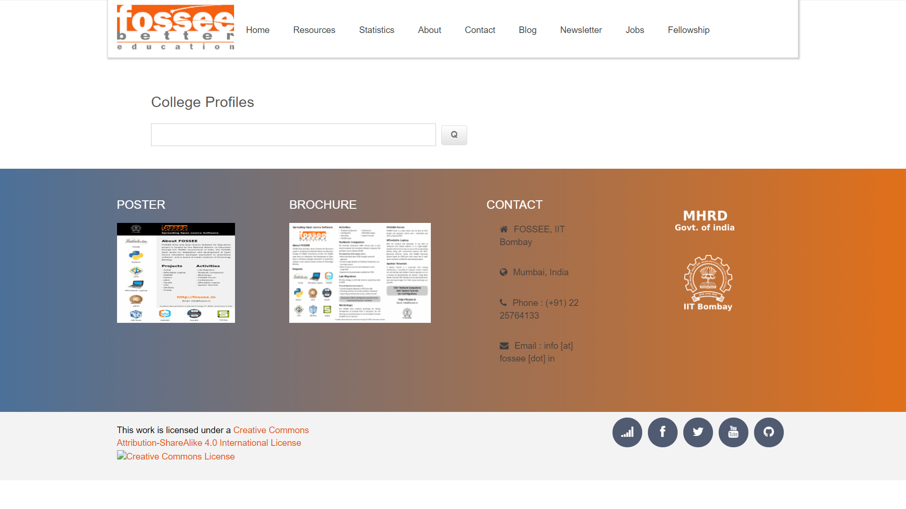
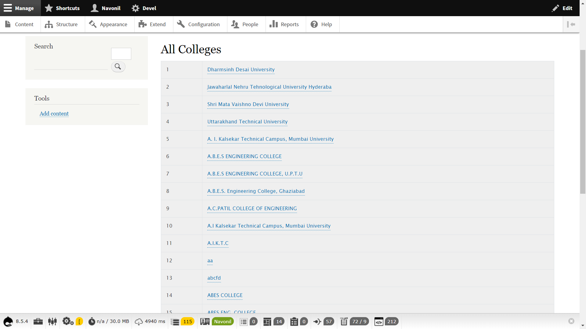
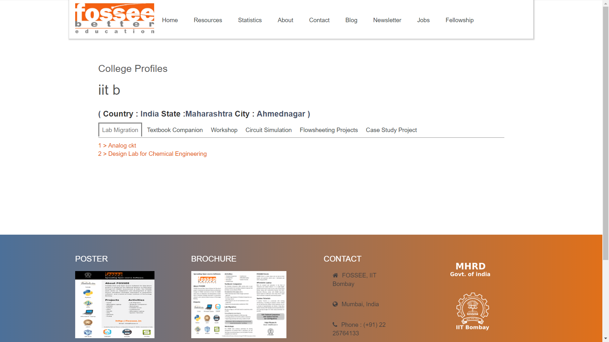
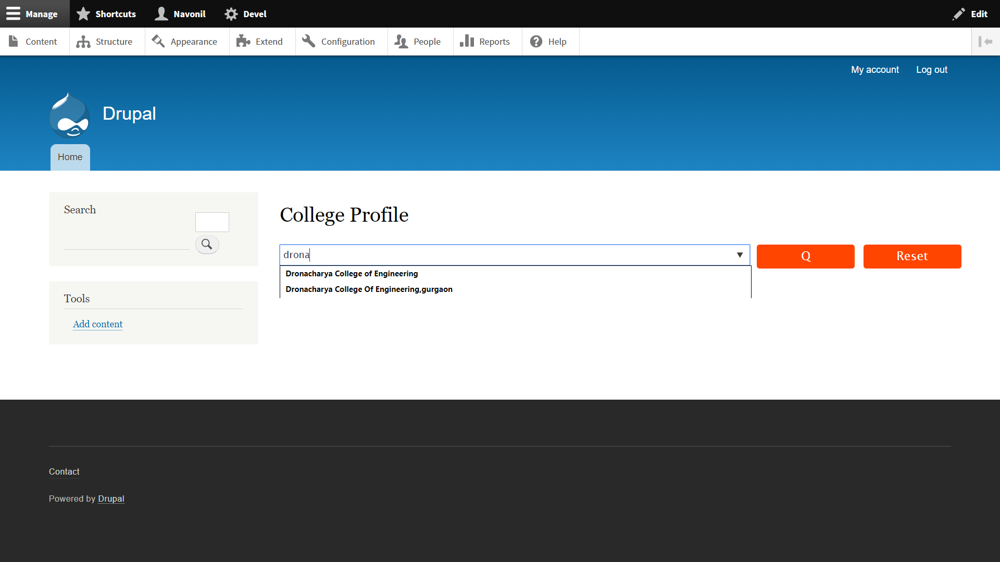
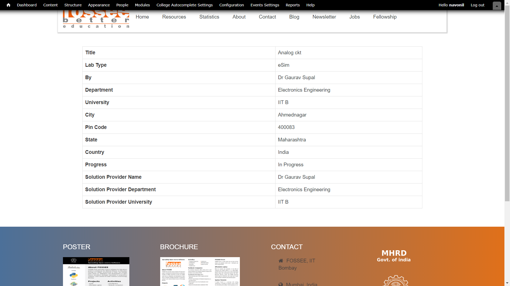
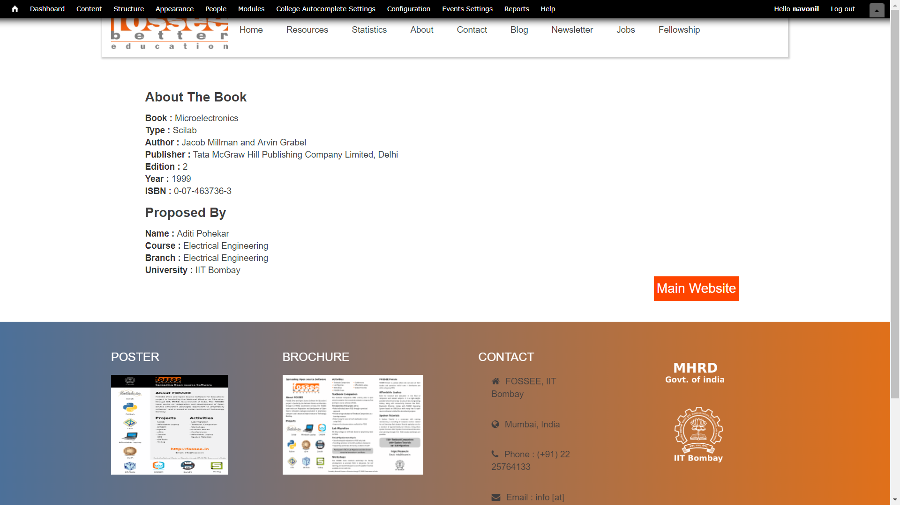
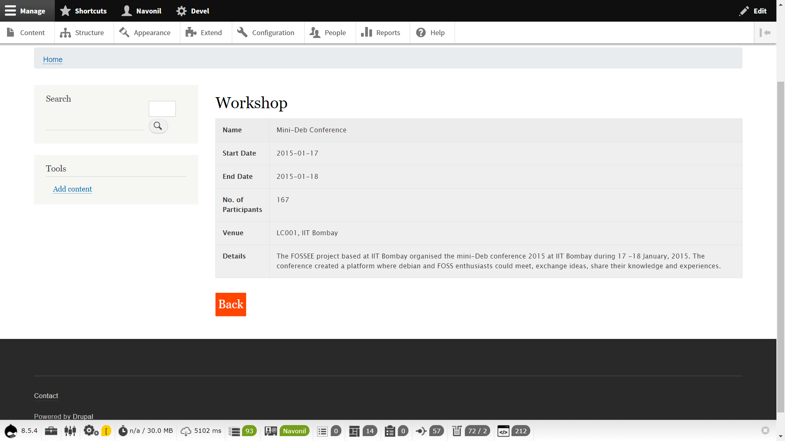
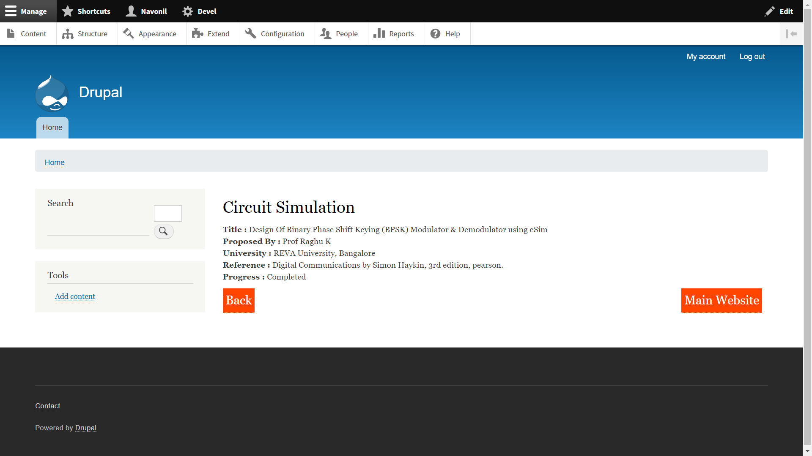
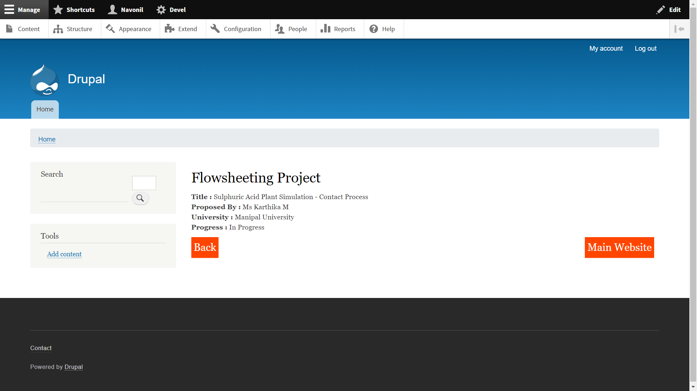

# fossee_institute_profiles Module
This is a Drupal 8 module used to display the profiles of institutes ie. Displays "Lab Migradtion","Textbook Companion","Workshop","Circuit Simulation","Flowsheeting Projects" etc.

## After installing the Module
Execute the script/insertdata.py file to generate a sql file to insert data chage the database name in the script if needed.

After executing the file it generate insertdata.sql import it in mysql.

## The Script
### Installation of Script
install the pymysql library for the script
```
pip install pymysql
```
change the database name (db_name) and table name (table_name) in script.py if necessary.
the script generates del.sql in the script folder import it to the mysql.
All the same name will be deleted.

## Paths
&lt;DrupalPath&gt;/cProfiles
This Paths is the main page of the module.
&lt;DrupalPath&gt;/cProfiles/all
this path displays all the college name present in the database

## Improve Autocomplete Suggestion
To improve autocomplete suggestion import insertdata.sql and then execute the script to remove duplicate.

## Screenshots

### Front Page


### All College
Displays All The College. Path <DrupalPath>/cProfiles/all


### Search Page
Display the Details of college in their respective tabs.


### Search Page Showing Suggestion


### Lab Migration
Display The Lab Migration details With their main Website


### Textbook Companion
Displays the Textbook companion details with their mainn website.


### Workshop
Displays details of workshops done by a college by respective images.


### Circuit Simulation
Display circuit simulation details by a college.


### Flowsheeting Project
Display Flowsheeting Project by a college.
